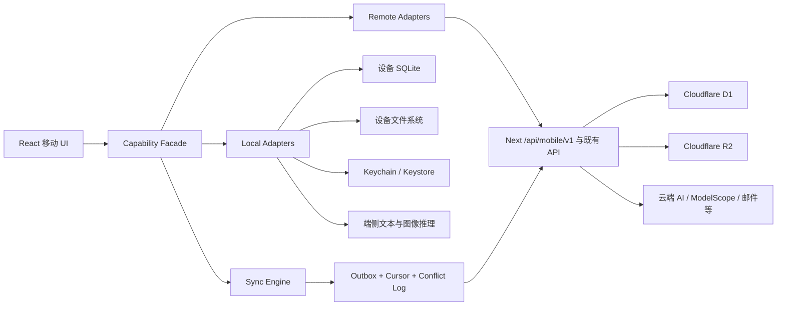

# Mahoshojo Generator APP 化与全离线架构方案

> 文档状态：建议稿<br>
> 调研时间：2026-07-29（Asia/Shanghai）<br>
> 适用项目版本：`0.8.2`<br>
> 目标平台：iOS、Android；可选扩展 Windows、macOS、Linux<br>
> 适用范围：现有 Next.js Web、Cloudflare 后端、移动 APP、Tauri 桌面端、游戏化交互、混合离线与全离线发行形态

## 1. 结论摘要

推荐采用“一套领域核心、三个应用外壳、一个共享游戏层、三种运行模式”的渐进方案：

1. 保留现有 Next.js + `@opennextjs/cloudflare` 应用，继续承担 Web 页面、Next Route Handler、Cloudflare D1/R2、在线 AI、账号、社区与多人能力。
2. 移动端根据产品目标在两条路线中通过 PoC 做最终选择：
   - 迁移优先：React + Vite + Capacitor，最大化复用现有 React DOM/Tailwind UI。
   - 产品体验优先：Expo/React Native，获得更自然的移动导航、手势、列表和系统组件。
3. 桌面端采用 Tauri + Vite + React，复用 Web 领域逻辑和可移植 React DOM 组件，通过 Rust command/plugin 接入本地文件、SQLite 和端侧模型。
4. Phaser.js 只作为共享游戏渲染层，用于 Challenge 地图、Arena 演出、PVP 棋盘和其他强交互场景，不承担表单、编辑器、长文本和应用导航。
5. 从现有代码中逐步提取与框架无关的 TypeScript 领域核心、协议类型和业务规则，由 Web、移动端、桌面端和 Phaser 场景共同使用。
6. 通过能力端口和适配器提供三种运行模式：
   - `remote`：所有需要服务端的能力继续调用 Next API。
   - `hybrid`：本地数据、本地规则与离线草稿优先；AI、社区、同步等能力按网络情况调用 Next API。
   - `standalone`：不发起网络请求；使用 SQLite、本地文件、设备密钥和端侧模型，并为账号、排行榜、PVP、消息等网络语义提供明确的本地替代体验。

首发建议是 `remote` 在线版，第二阶段演进到 `hybrid`，最后再将 `standalone` 作为可选的“离线创作包”。不建议把“所有线上能力原样离线”作为验收表述：依赖其他用户或服务器实时状态的能力无法在断网设备上保持全局语义一致，只能提供本地等价物或等待联网后同步。

推荐技术栈：

| 层级 | 推荐选型 |
| --- | --- |
| 移动运行时 | 产品体验优先选 Expo/React Native；迁移速度优先选 Capacitor |
| 桌面运行时 | Tauri 2 + Vite + React + TypeScript |
| 游戏渲染 | Phaser 3，仅作为 Canvas/WebGL 游戏岛 |
| Web/服务端 | 保留 Next.js App Router + OpenNext Cloudflare |
| UI | 移动端 React Native；Web/桌面端 React DOM + Tailwind 4；跨端共享设计 token 与无 UI 领域逻辑 |
| 状态与请求 | 复用 Zustand、TanStack Query；在外层增加能力适配器 |
| 本地结构化数据 | Expo 与 Tauri 各自接入 SQLite，共享 repository contract 与迁移语义，不复制完整 D1 schema |
| 本地文件 | Expo 文件接口；Tauri 文件插件/Rust command；统一由 `FilePort` 封装 |
| 凭据 | iOS Keychain、Android Keystore，由统一 `SecureVault` 接口封装 |
| 端侧文本模型 | Expo Module + Tauri Rust/native adapter；共享模型包协议、prompt 和结果 schema |
| 端侧图像模型 | 后置的高配设备可选包；低配设备保留模板渲染和本地素材导入 |
| 测试 | Vitest + API 合约测试 + iOS/Android 真机 E2E + 桌面 E2E + Phaser 回放测试 |

如果桌面客户端和游戏化只是远期设想、首要目标是尽快复刻当前 Web 功能，继续选择 Capacitor；如果二者已经是一等产品目标，并接受移动 UI 的重写成本，则优先验证 Expo + Tauri + Phaser。无论外壳如何选择，领域核心、API 合约、SQLite schema、同步协议和端侧模型接口都保持不变。

## 2. 目标、非目标与离线定义

### 2.1 目标

1. 用一套产品能力覆盖 iPhone、iPad、Android 手机和平板，并允许扩展 Windows、macOS 和 Linux 桌面客户端。
2. 最大化复用现有 React、TypeScript、Tailwind 与领域逻辑，避免一次性重写 33 个页面。
3. 在线模式继续复用现有 Next API、D1、R2、Better Auth 和 AI 渠道。
4. 网络不稳定时，创作、编辑、导入导出、历史记录和已缓存内容仍可用。
5. 在安装或导入必要模型包后，支持完全不联网的独立创作、对话和本地战斗。
6. 明确区分“服务器官方数据”和“设备本地数据”，避免签名、排行、审核或身份语义混淆。
7. 架构允许同一功能在远端实现和本地实现之间切换，而不是在组件中散落 `if (offline)`。
8. Challenge、Arena 和 PVP 等场景可共用确定性游戏核心与 Phaser 表现层。

### 2.2 非目标

1. 首个版本不要求 Web/桌面 React DOM UI 与移动 React Native UI 实现组件级或像素级共享。
2. 不在移动包中嵌入 Cloudflare、系统 AI、R2、邮件或签名私钥。
3. 不把完整 D1 数据库复制到每台设备。
4. 不承诺端侧小模型与云端大模型生成质量完全一致。
5. 不承诺离线设备能获知断网后发生的全局排行、消息、房间和审核变化。

### 2.3 离线等级

建议在产品和测试中使用明确等级：

| 等级 | 定义 | 典型能力 |
| --- | --- | --- |
| L0 在线 | 必须联网 | 登录注册、云端生成、公开排行、在线 PVP、消息、众查 |
| L1 弱网可恢复 | 请求可重试、恢复或排队 | 流式生成恢复、云端保存、素材上传、同步 |
| L2 离线优先 | 数据与核心操作先落本地 | 卡片编辑、卡组、会话、历史、导入导出、本地战斗规则 |
| L3 准备后全离线 | 曾联网下载过模型包，之后可长期断网 | 本地文本生成、本地对话、本地 AI 裁决 |
| L4 首次启动即全离线 | 安装包或离线安装介质已包含全部必要资源 | 独立发行版；代价是安装包大、设备要求高 |

“全离线版”至少应达到 L3；若业务明确要求无任何联网准备，则需单独构建 L4 发行物。

## 3. 当前项目盘点

### 3.1 可观察现状

本次静态盘点得到：

- 技术栈为 Next.js `15.3.8`、React `19.2.1`、Tailwind 4、Vercel AI SDK 6、OpenNext Cloudflare、D1、Drizzle、Better Auth。
- `app/` 下有 33 个 `page.tsx`。
- `app/api/` 下有 132 个 `route.ts` 和 131 个业务 `handler.ts`。
- `lib/database/schema.sql` 中有 50 个 `CREATE TABLE` 定义；认证、消息、审核、PVP、排位和 AI 渠道可用性还存在独立迁移。
- API 最大分组包括 PVP 27 个、Arena 14 个、`me` 13 个、认证 6 个，另有大量 AI 生成、卡片、卡组、消息和审核端点。
- 至少 52 个源文件直接使用 `localStorage`、`sessionStorage` 或 IndexedDB。
- 连续对话、战斗故事、挑战进度、公开卡缓存和魔法茶会已经具备浏览器端 IndexedDB 基础。
- 当前没有移动工程、Capacitor 配置、Web App Manifest 或 Service Worker。
- 当前前端大量使用相对地址 `/api/*`、Cookie/Bearer 混合认证、POST 流式响应和 SSE 格式。
- 服务端依赖 D1、可选 R2、AI 提供商、ModelScope、Resend、Turnstile、服务器签名密钥等外部能力。

### 3.2 已有可复用资产

可优先共享的内容包括：

- `types/` 中的数据类型。
- Zod schema、DTO mapper 和命名边界。
- `lib/creator`、`lib/arena`、`lib/challenge`、`lib/pvp` 中不依赖服务器或 DOM 的纯逻辑。
- 问卷、数据卡、酒馆卡、万途卡的解析、转换、校验和导入导出逻辑。
- Prompt、结构化 JSON 约束、流式文本解析和结果修复逻辑。
- Zustand store、TanStack Query 查询模型；大部分 React DOM 展示组件可供 Tauri/Capacitor 复用，但不能直接作为 React Native View 使用。
- 已有 IndexedDB 数据模型及迁移经验。

### 3.3 当前直接封装为 APP 的阻碍

当前 Next 应用不能直接作为 Capacitor 或 Tauri 的完整生产本地资源包：

1. Capacitor 的生产包要求存在独立 Web 构建目录，并在根部提供 `index.html`。
2. Capacitor 官方将 `server.url` 定义为 live reload 用途，不建议生产使用，因此不应让正式 APP 直接加载远端 Next 首页。
3. Tauri 同样需要由 `frontendDist` 指向可本地打包的静态前端产物；它不会把 Next Route Handler 自动转换成 Rust 后端。
4. Next 静态导出不包含运行时服务器。当前项目的 POST/PUT/DELETE Route Handler、请求 Cookie、Middleware、redirects、headers、动态数据和 Server 逻辑均不能随静态文件一起运行。
5. 即使只导出 UI，相对 `/api/*` 会指向 APP 本地 origin，而不是线上 Next 服务。

因此，推荐分别新增可本地构建的移动入口和桌面入口，并让它们复用领域包、协议及适用的 Web 组件，而不是对当前 Next 根应用执行 `output: 'export'`。

## 4. 全离线的可达边界

### 4.1 可以完整内置的能力

只依赖当前输入、设备本地数据和可随 APP 分发的算法或模型时，能力可以离线化，例如：

- 问卷填写、角色/情景/历史卡编辑。
- JSON、PNG、酒馆卡、万途卡的解析、转换、校验与导入导出。
- 卡片渲染、Markdown、KaTeX、拼音与本地敏感词规则。
- 本地卡库、卡组、收藏、草稿、回收站和历史。
- 确定性的战斗规则、挑战地图、奖励、Bot 策略。
- 已安装端侧模型后的角色生成、情景生成、连续对话、战报和 AI 裁决。
- 本地素材管理、截图、分享、备份与恢复。

### 4.2 只能提供本地替代物的能力

以下能力的定义包含服务器或其他用户的当前状态：

- 账号注册、密码找回、兑换码。
- 公开数据卡、点赞、全局收藏数和社区审核。
- 全局排行榜、严格排位和反作弊。
- 在线 PVP 房间、聊天、投票和多人同步。
- 站内消息、徽章授予、举报、申诉与众查。
- 服务端官方签名和原生性证明。

离线版可以提供本地档案、本地榜单、Bot/同屏对战、缓存的公开卡快照、待同步举报草稿和本地成就，但不能把这些结果冒充全局或官方结果。

### 4.3 不可能原样离线的下界说明

假设两个离线设备拥有完全相同的本地状态。设备断网后，服务器在情形 A 中新增一条消息，在情形 B 中没有新增消息。两个设备在本地能观察到的信息仍完全相同，所以任何本地算法在两种情形下都只能给出同一个答案，不可能同时正确回答“当前是否有新消息”。

同理：

- 没有网络且设备没有模型参数时，设备无法重建只存在于云端模型中的生成能力。
- 把服务器 HMAC 私钥放进 APP 才能离线产生“官方签名”，但任何用户都能提取该私钥，官方签名随即失去可信性。
- 离线客户端无法证明另一位远程玩家此刻做了什么，也无法保证全局排行一致。

所以“能力完整”的可保证口径应是：所有本地创作流程均可完成；所有网络语义都有清晰的离线状态、缓存或本地替代物；恢复联网后可安全同步。若要求全局在线语义原样成立，则需求本身不可实现。

## 5. 目标架构



核心原则是 UI 不直接判断网络状态，也不直接 `fetch('/api/...')`。组件只调用稳定的领域端口：

```ts
export interface GenerationPort {
  generateCharacter(input: CharacterGenerationInput): AsyncIterable<GenerationEvent>;
  generateScenario(input: ScenarioGenerationInput): AsyncIterable<GenerationEvent>;
}

export interface CardRepository {
  list(query: CardQuery): Promise<CardSummary[]>;
  get(id: string): Promise<Card | null>;
  save(card: Card): Promise<SaveCardResult>;
  remove(id: string): Promise<void>;
}

export interface CommunityPort {
  getPublicCards(query: PublicCardQuery): Promise<PublicCardPage>;
  publish(cardId: string): Promise<PublishResult>;
}
```

分别提供：

- `RemoteGenerationAdapter`：调用 Next 流式 API。
- `LocalGenerationAdapter`：调用原生端侧推理插件。
- `SyncedCardRepository`：本地 SQLite 立即提交，并写入同步 Outbox。
- `RemoteCommunityAdapter`：只在联网且用户授权时工作。
- `OfflineCommunityAdapter`：只读取已签名的缓存快照或导入包。

运行模式由应用组合根统一决定，业务组件不感知具体适配器。

## 6. 三种 APP 运行方案

### 6.1 方案 A：在线 APP

这是投入最低、最快上架的版本。

移动端本地打包 UI、字体、预设、基础图片和必要 JS；登录、数据卡、生成、排行、PVP、消息等继续请求线上 Next API。现有 D1/R2 和 AI 渠道无需迁移。

需要完成：

- 将组件中的相对 `/api/*` 收口到 `ApiClient`，由 `MOBILE_API_BASE_URL` 指向生产 Next 域名。
- 增加移动 API 鉴权方案，避免依赖 WebView 跨站 Cookie 的偶然行为。
- 用 Keychain/Keystore 保存刷新凭据，淘汰移动端 `localStorage` 凭据。
- 为 CORS、可信 origin、CSRF、深链和密码重置建立移动端契约。
- 验证所有 POST 流式接口在 iOS WKWebView 和 Android WebView 中的取消、超时和长文本行为。
- 用原生文件、分享、剪贴板和状态栏能力替换仅适合浏览器的下载交互。

优点是后端改动可控，云端质量与 Web 保持一致。缺点是断网时只能使用本地 UI、预设、草稿和已缓存数据。

### 6.2 方案 B：混合离线 APP

这是推荐的长期默认形态。

本地 SQLite 成为私有创作数据的即时读写源；服务端成为同步、社区和多设备协作源。用户可以离线创建和编辑，联网后由同步引擎增量推送。

默认能力分配：

- 本地：草稿、私有卡、卡组、会话、历史、挑战进度、素材索引、导入导出、确定性规则。
- 远端：系统 AI、账号、公开数据、审核、排行、PVP、消息、R2 备份。
- 可选择：用户安装文本模型包后，AI 生成可在本地和远端之间切换。

对用户暴露的模式不应只是一个含糊的“离线开关”，而应显示每项任务的执行位置：

- `云端生成`
- `设备生成`
- `自动选择`

同时在结果元数据中记录 `runtime: remote | local`、模型标识、模型包版本和签名状态。

### 6.3 方案 C：全离线独立版

全离线版在启动后禁止所有网络访问，使用本地身份、本地数据、本地模型和本地素材。建议做成明确的运行配置或单独发行 flavor，避免用户误以为本地成绩会参与全局社区。

必须内置或提前导入：

- 基础预设、百科快照和规则。
- SQLite schema 与迁移。
- 文本模型、Tokenizer、结构化输出语法和必要安全模型。
- 可选图像模型或离线视觉素材包。
- 本地内容安全规则。
- 设备备份/恢复与模型包验证公钥。

网络语义替代：

- 账号改为设备本地档案，可选系统生物识别解锁。
- PVP 改为 Bot、同屏轮流操作；同局域网对战可作为后续独立能力。
- 排行改为设备本地统计。
- 公开卡改为随版本发布的只读快照、用户导入的离线内容包。
- 消息、举报、申诉和众查显示为“需要在线服务”，只允许保存待提交草稿。
- 徽章分为“本地成就”和“服务器徽章”，视觉和数据字段必须区分。

全离线版最主要的工程成本不是 WebView 封装，而是端侧模型、数据同步边界、模型包分发、性能分级和产品语义调整。

## 7. 能力迁移矩阵

| 能力域 | 当前主要依赖 | 在线版 | 混合版 | 全离线版 |
| --- | --- | --- | --- | --- |
| 名字、问卷、角色、情景创作 | React、规则、Next AI API | Next API | 本地规则 + 远端/本地 AI 可选 | 端侧模型 |
| 自由创作、残兽、升华 | Next AI、签名、安全检查 | Next API | 本地草稿，生成可切换 | 端侧模型；标记本地来源 |
| 数据卡、卡组、收藏、回收站 | D1、认证 | Next API | SQLite 主存储 + 增量同步 | 纯 SQLite |
| 公开卡、标签、点赞 | D1、审核、全局计数 | Next API | 在线权威 + 离线缓存 | 只读快照/导入包；无全局写入 |
| 竞技场战报 | AI、D1、R2、签名 | Next API | 本地会话 + 远端/本地 AI | 本地规则和端侧模型 |
| 严格排位、排行榜 | D1、反作弊、服务器签名 | Next API | 在线时可用，离线只读缓存 | 本地练习榜，不计入官方排行 |
| Challenge | IndexedDB、AI 裁决、公开卡候选 | Next API + 本地进度 | SQLite 进度 + 可选本地裁决 | 本地世界包、Bot 和端侧裁决 |
| 魔法茶会/连续对话 | IndexedDB、流式 AI | Next API | SQLite 会话 + AI 可切换 | 端侧模型 |
| 酒馆卡/万途卡导入导出 | 客户端解析、文件 API、部分 AI | 可内置 | 完整内置，AI 可切换 | 完整内置 |
| 立绘生成 | ModelScope、远端任务轮询 | Next API | 在线生成 + 本地缓存 | 高配设备可选图像包；否则素材导入/模板 |
| PVP 房间、聊天、投票 | D1、其他玩家、轮询/流式 AI | Next API | 在线可用，断线恢复 | Bot/同屏；不冒充在线 PVP |
| 用户、密码找回、兑换码 | Better Auth、D1、Turnstile、Resend | Next API | 在线身份 + 离线本地档案 | 本地档案；无服务器账号操作 |
| 消息、举报、申诉、众查 | D1、全局流程 | Next API | 在线处理，离线保存草稿 | 仅草稿/说明 |
| 徽章、个人主页 | D1、服务器授予 | Next API | 缓存 + 同步 | 本地成就，独立命名 |
| 大对象与素材 | R2、Blob、浏览器下载 | R2 | 本地文件 + R2 同步 | 本地文件 |
| 内容安全 | 本地规则、服务端 AI 审核 | 服务端终审 | 本地预检 + 发布时服务端终审 | 本地规则/分类器，仅对本地负责 |
| 原生性签名 | 服务器 HMAC 密钥 | 服务端签名 | 服务端签名；本地结果待认证 | 设备签名，只表示本机来源 |

## 8. 技术栈比较与选择

| 方案 | 现有 UI 复用 | 原生能力 | 全离线能力 | 主要代价 | 结论 |
| --- | --- | --- | --- | --- | --- |
| PWA | 最高 | 中低，平台差异较大 | 只能离线静态资源和客户端逻辑 | 商店与系统集成弱，无法携带 Next 运行时 | 作为前置优化，不作为最终双端方案 |
| 当前 Next 直接静态导出后套壳 | 表面最高 | 中 | 受限 | 当前 Route Handler、Middleware、动态请求无法导出 | 不采用 |
| Capacitor 移动端 + Tauri 桌面端 | 移动和桌面都较高 | 高 | 高 | 移动端仍以 WebView UI 为主 | 迁移速度优先路线 |
| Expo 移动端 + Tauri 桌面端 + Phaser | 领域逻辑和游戏层高，普通 UI 低 | 高 | 高 | React Native、Web、Rust 三套宿主及两套本地桥接 | 原生体验与游戏化优先路线 |
| 仅 Expo/React Native，不做桌面 | 领域逻辑可复用，DOM UI 需重写 | 高 | 高 | Markdown、KaTeX、复杂卡片、截图和 CSS 需重做 | 仅移动产品时可选 |
| Flutter/KMP/全原生 | 低 | 最高 | 高 | 两套语言与 UI，大规模重写 | 当前阶段不推荐 |
| Tauri Mobile | Web UI 可复用 | 较高 | 较高 | Rust 与移动插件生态增加不确定性 | 只做备选调研 |

Capacitor 路线的价值不是“零改动套壳”，而是保留当前最主要的 React DOM、Tailwind、Markdown、复杂卡片和浏览器端编辑工作台资产。Expo + Tauri + Phaser 路线则主动接受移动 UI 重写，以换取更好的原生移动体验、正式桌面客户端和可持续扩展的游戏表现层。

### 8.1 Expo + Tauri + Phaser 的真实运行结构

这条路线并不是 Expo 直接以 React Native View 渲染 Phaser。Phaser 是 HTML5 Canvas/WebGL 框架，在 Expo 中需要运行于 DOM Component/WebView 游戏岛：

```text
                         Next.js / Cloudflare
                         API、D1、R2、在线 AI
                                  ↑
              ┌───────────────────┴───────────────────┐
              │                                       │
      Expo / React Native                     Tauri / React DOM
      导航、列表、表单、系统 UI                桌面窗口、编辑器、文件菜单
              │                                       │
      Expo DOM Component                      系统 WebView 直接挂载
              └────────────── Phaser ─────────────────┘
                              │
                   game-core / contracts
```

Expo 当前 DOM Components 会在底层使用 WebView 承载带有 `'use dom'` 的浏览器组件，并允许通过顶层异步函数把语义动作传回原生侧。因此移动端可以承载 Phaser，但必须把它视作 WebView 子系统，而不是普通 React Native 组件。

推荐的状态边界：

- `game-core` 保存确定性规则、随机种子、回放事件和可持久化状态。
- `game-phaser` 负责 Scene、摄像机、动画、粒子、音频和指针输入。
- Expo/Tauri 外壳负责账号、文件、网络、SQLite、端侧模型和页面导航。
- 外壳向 Phaser 发送状态快照或高层命令。
- Phaser 只返回 `selectCard`、`chooseNode`、`submitTurn`、`animationComplete` 等语义事件。
- 禁止通过 Expo/WebView bridge 逐帧同步坐标、粒子、物理对象或大段纹理数据。

对于当前以回合、选牌、地图节点和 AI 叙事为主的玩法，这种粗粒度桥接是合适的；若未来变成高频动作游戏，则应让实时模拟完整留在 Phaser 内，仅向外提交检查点和最终结果。

### 8.2 Phaser 的职责边界

建议使用 Phaser 的场景：

- Challenge 地图、路径、节点状态和战斗转场。
- Arena 战斗演出、角色入场、技能和结算动画。
- PVP 棋盘、选牌、投票状态和回合表现。
- 立绘、背景、粒子、镜头和音频组合。
- 可视化剧情分支与回放。

不建议使用 Phaser 的页面：

- 登录、注册、账号安全和设置。
- 角色/情景/问卷表单与复杂编辑器。
- 数据卡、卡组、消息、举报、申诉和众查列表。
- Markdown、KaTeX、长篇战报阅读。
- 文件管理、模型管理和无障碍密集页面。

把整套 APP 放进 Phaser Canvas 会显著增加文本输入、长列表、无障碍、响应式布局和自动化测试成本。

### 8.3 两条路线的选择规则

选择 Capacitor 移动端的条件：

- 首要目标是最快达到现有 Web 功能覆盖。
- 团队暂时不愿承担 React Native UI 重写。
- 游戏化只是局部增强，原生移动体验不是主要竞争点。
- 桌面端主要复用现有 React DOM 工作台。

选择 Expo + Tauri + Phaser 的条件：

- 移动端原生导航、列表、手势和系统集成是长期产品要求。
- Windows/macOS 等桌面客户端是一等产品，而不是网站快捷方式。
- Challenge、Arena、PVP 会持续增加游戏化表现。
- 团队接受 React Native + Web/TypeScript + Rust，以及 Expo/Tauri 两套本地能力适配器。

建议 Phase 0 同时验证一个共享 Phaser 垂直切片，再作最终 ADR，不要只根据框架介绍选择路线。

## 9. 推荐仓库结构

当前 `pnpm-workspace.yaml` 只有构建策略配置，尚未声明应用或包目录。建议渐进调整为：

```text
app/                         # 现有 Next 页面与 API，迁移期保留
components/                  # 现有 Web 组件
lib/                         # 现有逻辑，逐步拆分
apps/
  mobile/                    # 最终 ADR 选择 Expo 或 Capacitor，只保留一个正式实现
    src/
    game-dom/                # Expo 路线下的 Phaser DOM Component 入口
  desktop/                   # Tauri + Vite + React
    src/
    src-tauri/
packages/
  contracts/                 # DTO、Zod schema、错误码、事件协议
  domain/                    # 纯 TypeScript 规则与用例
  game-core/                 # 确定性玩法状态机、随机种子、事件与回放
  game-phaser/               # Phaser Scene、渲染、动画、输入、音频
  api-client/                # Next API、SSE、鉴权、重试
  local-data/                # SQLite repository、迁移、Outbox
  runtime/                   # remote/hybrid/standalone 组合根
  ui-web-shared/             # Web 与 Tauri 可共享的 React DOM 组件
  design-tokens/             # 移动、Web、桌面共用的语义 token
  model-runtime-contracts/   # 模型包与原生插件协议
```

迁移时不必先移动整个 Next 项目。先在根项目旁增加 `apps/mobile`、`apps/desktop` 与少量 `packages/*`，待边界稳定后再决定是否把 Web 移入 `apps/web`，可以降低路径别名、Cloudflare 构建和部署脚本一次性变化的风险。

共享包必须满足：

- 不导入 `next/*`、Cloudflare binding、Node 专属模块或浏览器全局。
- 不直接访问 `window`、`localStorage`、IndexedDB、D1 或文件系统。
- 输入输出使用 camelCase DTO。
- SQLite/D1 内部继续使用 snake_case，并在 repository/mapper 边界转换。
- 时间、UUID、随机数、网络和存储均通过依赖注入，以便复现测试。
- `game-core` 不得导入 Phaser、Expo、React Native、Tauri 或 DOM。
- `game-phaser` 只依赖 Web 运行时，不持有账号、同步和服务器权威状态。

## 10. 在线 API 与认证改造

### 10.1 API 客户端收口

建立统一 `ApiClient`：

- Web 使用同源 base URL。
- 移动使用显式 HTTPS base URL。
- 自动附加版本、客户端平台、APP 版本、请求 ID 和幂等键。
- 统一解析 JSON、SSE、错误码、限流和超时。
- 支持 `AbortSignal`、前后台切换和断线重连。
- 禁止组件继续新增裸 `fetch('/api/...')`。

既有 API 可继续工作，但移动专用需求建议逐步收口到 `/api/mobile/v1/*`，不要永久在客户端拼接 132 个端点的细节。

### 10.2 移动鉴权

当前 `lib/auth.ts` 使用 `localStorage` 保存认证数据，并用代码内固定字符串派生 AES 密钥。由于固定密钥会随 APP 一起交付，它只能防止直接肉眼读取，不能抵抗设备或包分析，不能继续作为移动凭据保护方案。

推荐：

1. 继续以 Better Auth 对应的服务器用户为唯一在线身份，不新建第二套云端用户。
2. 新增移动会话交换流程，签发短期 access token 与可轮换 refresh token，或使用经官方支持验证的原生客户端会话方案。
3. refresh token 只进入 Keychain/Keystore；access token 只在内存中短期缓存。
4. 密码找回使用 Universal Link/App Link 回到 APP；失败时回退系统浏览器。
5. Turnstile 等 Web 挑战通过系统浏览器或受控挑战页完成，不依赖本地 WebView origin 恰好被接受。
6. CORS 只允许实测得到的移动 origin 和正式 Web origin；带凭据时禁止 `*`。
7. 本地离线档案与在线账号分开建模，联网登录不应覆盖未同步的本地数据。

### 10.3 长任务与流式生成

现有 AI 流通常持续时间较长，移动操作系统又不保证 APP 进入后台后继续执行 JavaScript。远端生成应逐步采用：

1. `POST` 创建带幂等键的生成任务。
2. 返回任务 ID，并通过流式连接展示增量结果。
3. APP 被挂起或连接断开后，可用任务 ID 恢复。
4. 服务端持久化必要的状态、输出预览和最终结果。
5. 客户端取消要区分“停止显示”“请求取消”和“服务端任务取消”。

现有非流式 API可以作为 WebView 流式兼容失败时的降级路径。

## 11. 本地数据与同步

### 11.1 不复制完整 D1

移动数据库只存设备需要的数据，不复制管理员分析、全局反作弊、全局消息投递、众查分配等服务端表。建议的本地核心表包括：

```text
local_profiles
cards
decks
deck_cards
favorites
sessions
messages_local
generation_runs
assets
challenge_runs
outbox
sync_cursors
sync_conflicts
model_packs
settings
```

每个可同步实体至少包含：

```text
id                 # 客户端生成 UUID
remote_id          # 可空，服务器对应 ID
revision           # 本地已知服务器版本
payload_json
created_at
updated_at
deleted_at
sync_status
```

### 11.2 同步协议

建议新增批量增量协议：

```text
POST /api/mobile/v1/sync/push
GET  /api/mobile/v1/sync/pull?cursor=<opaque>
POST /api/mobile/v1/assets/upload-intent
```

要求：

- Outbox 写入与本地业务写入处于同一 SQLite 事务。
- 每个 mutation 有客户端幂等键，服务端重复接收不会重复创建。
- pull cursor 对客户端保持 opaque，客户端不得自行推导。
- 删除使用 tombstone，至少保留到所有活跃设备越过相应 cursor。
- 同步失败不回滚用户已经完成的本地编辑。
- 公开、排行、审核和计数类字段由服务器权威覆盖。

### 11.3 冲突策略

| 数据类型 | 冲突策略 |
| --- | --- |
| 卡片正文、情景、问卷 | 不静默覆盖；保留两份，生成“冲突副本”供用户合并 |
| 会话消息、战斗历史 | 以 UUID 追加合并，保持不可变事件 |
| 展示名称、设置 | 可使用最新更新时间，但保留变更日志 |
| 收藏关系 | 集合合并；删除使用 tombstone |
| 排名、点赞数、审核状态 | 服务器权威 |
| 大文件 | 内容 hash 去重；元数据冲突单独处理 |

不能只依赖客户端时间做最后写入者获胜，因为移动设备时钟可能错误。服务端 revision、逻辑序列和幂等键应共同参与判断。

### 11.4 Web 数据迁移到 APP

Expo DOM Component、Capacitor 或 Tauri 的本地 origin/存储空间都与现有网站 origin 隔离，不能假设 APP 能直接读取用户浏览器中的 `localStorage` 或 IndexedDB。

迁移路径应包括：

- 已登录用户通过服务器同步 D1/R2 数据。
- Web 与 APP 都支持导出/导入版本化的 `.mahoshojo` 备份包。
- 备份包包含 manifest、JSON 数据、素材 hash 和 schema 版本。
- 大文件可分卷或按需导入。
- 导入先校验 schema、大小、hash 和路径，禁止 Zip Slip 与任意文件覆盖。

## 12. 端侧 AI 设计

### 12.1 文本模型

不建议把端侧 AI 首先实现为 WebView 内的 WebGPU/WASM 推理。主要方案应是原生推理插件：

```text
TypeScript LocalGenerationAdapter
        ↓ Expo Module / Capacitor Plugin / Tauri Command
iOS Swift/Objective-C++   Android Kotlin/JNI   Desktop Rust/native
        ↓
跨平台原生推理内核
```

第一轮 PoC 应比较至少两种可嵌入内核，重点不是模型榜单分数，而是：

- iOS/Android 是否能共用模型格式。
- 首 token 延迟、持续 tokens/s、峰值内存。
- 8K 或业务实际上下文长度下是否稳定。
- 结构化 JSON 成功率。
- 取消、恢复、前后台切换行为。
- 10 分钟持续生成的温升与耗电。
- 模型与运行库许可证是否允许商用分发。

端侧生成流水线：

1. 复用共享 prompt builder 和 Zod schema。
2. 使用 grammar/约束解码优先产生合法 JSON。
3. 本地执行 JSON 修复和 Zod 校验。
4. 校验失败时进行一次有上限的修复生成。
5. 保存模型 ID、量化、模型包版本、prompt 版本和运行指标。
6. 本地结果永远不伪装成服务器官方签名结果。

### 12.2 模型包

模型权重通常会让安装体积从数百 MB 增长到数 GB，因此建议基础 APP 与模型包解耦：

- 基础包只包含 UI、规则和轻量资源。
- L3 模式由用户下载或从文件导入签名模型包。
- L4 独立发行物预装选定模型包。
- 模型包 manifest 包含 ID、版本、量化、上下文上限、最低设备等级、许可证、文件 hash 和签名。
- 下载支持断点续传、空间预检、校验、原子切换与旧版本回滚。
- 删除模型不能删除用户生成数据。

设备能力不足时必须在下载前阻止安装，而不是等推理时 OOM。

### 12.3 图像与立绘

端侧图像生成是全离线版中成本和设备门槛最高的部分，建议分层：

1. 所有设备：本地卡片渲染、模板组合、用户素材导入。
2. 中高配设备：可选轻量图像模型包。
3. 在线模式：继续通过 Next API 调用 ModelScope 等远端服务。

图像 PoC 未达成内存、耗时、发热和许可证门禁前，不应让它阻塞在线 APP 与本地文本能力交付。

### 12.4 安全检查与签名

- 本地敏感词、拼音、规则检查可以直接内置。
- 公开发布仍必须接受服务器终审，本地检查不能替代社区审核。
- 现有 HMAC `SIGNATURE_SECRET_KEY` 不得进入 APP。
- 建议新增非对称签名版本：服务器保存私钥，APP 内置公钥，仅用于验证官方内容。
- 本地创作可由设备密钥签名，字段应明确为 `deviceAttestation` 或 `localProvenance`，不能复用“官方原生”标志。

## 13. iOS、Android 与桌面平台集成

### 13.1 移动两端共用能力

- SQLite、文件导入导出、分享、剪贴板。
- 安全凭据、网络状态、深链。
- 模型下载、hash/签名验证、原生推理。
- Splash Screen、状态栏、键盘、安全区和触感反馈。
- APP 版本、schema 版本和模型包版本上报。

### 13.2 iOS 重点

- WKWebView 的大文本流、Blob、下载和内存回收真机测试。
- Keychain 与系统 Data Protection。
- Universal Link、密码重置和系统浏览器认证回跳。
- APP 被挂起后，不假设 JavaScript 或生成任务能继续运行。
- iPhone 与 iPad 的安全区、键盘、横竖屏和多窗口布局。

### 13.3 Android 重点

- 不同厂商 WebView 版本和内存策略。
- Keystore、文件共享 `content://` URI 与权限最小化。
- App Link、返回手势、键盘和系统栏。
- Doze、后台限制和进程被系统回收后的恢复。
- ABI、模型文件位置、存储空间不足和低端设备降级。

### 13.4 Tauri 桌面端重点

- 前端由本地 `frontendDist` 启动，不把生产桌面客户端配置成远端网页容器。
- Windows、macOS 和 Linux 使用不同的系统 WebView，必须分别验证 Phaser、WebGL、字体、音频、视频和文件行为。
- Rust command 与插件使用最小 capabilities；文件访问限定到用户明确选择的路径和应用数据目录。
- CSP 默认拒绝未声明来源，线上 Next API、模型下载和外部链接分别设置 allowlist。
- 提供桌面文件菜单、拖放导入、多窗口策略、快捷键、窗口状态恢复和系统通知。
- SQLite、模型、缓存、日志和用户导出目录必须区分，卸载与升级行为需要写入产品约定。
- 本地推理库或 sidecar 必须锁定版本、校验签名，并限制其命令参数与文件范围。
- Windows/macOS 首发时完成代码签名、安装包升级和崩溃恢复；Linux 在成为正式目标后纳入发行矩阵。

### 13.5 必须提供的原生价值

为了让移动与桌面客户端不只是网站快捷方式，首发至少应具备：

- 原生文件导入、导出和系统分享。
- Keychain/Keystore 凭据。
- 离线草稿和进程恢复。
- 深链。
- 网络状态与同步队列。
- 原生状态栏、键盘、安全区适配。
- 桌面文件菜单、拖放、快捷键和窗口状态恢复。

后续再加入推送、触感、端侧模型和本地素材库。

## 14. 安全与隐私

1. 系统 AI、R2、D1、邮件和签名私钥只存在服务端。
2. 用户 BYOK 存入 Keychain/Keystore，不写 `localStorage`、日志、崩溃报告或备份明文。
3. BYOK 默认经 Next API 进行瞬时代理；若支持设备直连提供商，应使用原生 HTTP、域名 allowlist 和明确隐私提示。
4. SQLite 中的高敏感数据依赖系统文件保护；威胁模型需要更强时再引入 SQLCipher，并评估导出与迁移成本。
5. 所有模型包、百科包和离线内容包必须校验 hash 与签名。
6. WebView 禁止任意导航和不受控脚本注入，外部链接交给系统浏览器。
7. 离线模式提供“禁止网络”硬开关，测试时通过代理或系统日志证明零出站请求。
8. 分析、崩溃和性能遥测必须告知用户；standalone 模式默认关闭。
9. Root/Jailbreak 设备上的本地秘密无法获得绝对保护，产品不得据此授予服务器官方信任。

## 15. 分阶段实施计划

以下工期是假设 2 名全职工程师、设计与 QA 兼职参与的粗略量级，不是排期承诺。

### Phase 0：架构与跨端 PoC，约 2～3 周

交付：

- `apps/mobile` 最小 Expo/React Native 包，以及一个 Phaser DOM Component。
- `apps/desktop` 最小 Tauri/Vite/React 包。
- 同一个 `game-core` 状态与 `game-phaser` 场景在移动和桌面运行。
- iOS 与 Android 真机安装；至少完成目标 Windows/macOS 桌面系统的安装验证。
- 两端验证 Next API、登录、一个 POST 流、一个文件导入导出、SecureVault 和 SQLite。
- 用一个小模型分别验证 Expo Module 与 Tauri adapter 的 token stream、取消、结构化 JSON 和峰值内存。
- 确认应用 ID、桌面 bundle identifier、最低系统版本和最低端侧 AI 设备档位。

门禁：

- 移动和桌面生产包都从本地资源冷启动，不依赖远端页面。
- Phaser 素材完全离线加载，移动端恢复前台后不白屏、不重复创建 Scene。
- 同一随机种子和动作序列在移动、桌面得到相同 `game-core` 结果。
- Phaser bridge 只传语义事件和检查点，不逐帧传输渲染状态。
- 移动真机连续运行 Phaser 场景 15 分钟，无明显掉帧、失控发热、音频失效或内存增长。
- 一次 10 分钟 AI 流式任务无崩溃。
- 认证凭据未进入 Web 存储。

### Phase 1：在线移动/桌面 MVP，约 8～12 周

交付：

- Expo 移动导航、登录、创作入口、卡片查看编辑、在线生成、Arena 基础流程。
- Tauri 桌面窗口、导航、文件菜单、创作工作台和在线生成基础流程。
- 一个 Phaser 垂直切片，建议选择 Challenge 地图或 Arena 战斗演出。
- 统一 `ApiClient`、错误处理、流式取消和恢复。
- 原生文件、分享、深链、安全区和键盘适配。
- TestFlight、Google Play 和桌面签名安装包内测流水线。

暂不要求：

- 完整同步引擎。
- 端侧图像生成。
- 所有管理和社区长尾页面达到最佳移动布局。

### Phase 2：离线优先数据层，约 6～10 周

交付：

- SQLite repository、迁移、Outbox、cursor sync。
- 私有卡、卡组、会话、挑战进度、本地素材离线可用。
- Web/APP 版本化备份包。
- 冲突副本、同步状态和人工恢复界面。
- 断网、杀进程、磁盘不足和升级迁移测试。

### Phase 3：端侧文本 AI，约 8～12 周

交付：

- 签名模型包管理器。
- 本地生成、对话、战报和裁决适配器。
- 模型设备分级、质量基准、性能与热测试。
- 本地安全预检和结果来源元数据。
- remote/local/auto 用户选择。

### Phase 4：独立全离线版，约 4～8 周

交付：

- 零网络运行配置。
- 本地档案、本地榜单、Bot/同屏 PVP。
- 离线百科和内容包。
- 可选图像模型 PoC 达标后的高配设备包。
- 完整备份恢复、网络审计和离线用户说明。

总体量级：

- Capacitor 移动端、暂不交付桌面端：在线 MVP 约 8～10 周，稳定混合离线版约 14～20 周，含端侧 AI 的完整独立版约 22～32 周。
- Expo 移动端 + Tauri 桌面端 + Phaser：在线跨端 MVP 约 11～15 周，稳定混合离线版约 18～26 周，含端侧 AI 的完整独立版约 28～40 周。
- 桌面 Linux、端侧图像模型、同局域网 PVP 和复杂 Phaser 演出不应默认计入上述 MVP。

## 16. 测试与验收

### 16.1 在线版

- iOS、Android 与目标桌面系统均能注册/登录、退出、恢复会话和处理密码重置深链。
- 现有核心 Next API 合约保持兼容。
- AI 流可展示、取消、断线恢复，APP 前后台切换不会生成重复记录。
- D1/R2、公开卡、排行、消息和 PVP 与 Web 数据一致。
- BYOK 不出现在 Web 存储、日志和崩溃附件中。

### 16.2 混合版

- 飞行模式冷启动后可创建、编辑、删除、恢复和导出私有卡。
- 断网操作在重启 APP 后仍留在 Outbox。
- 同一操作重复上传不产生重复数据。
- 两设备同时编辑同一正文时不会静默丢失任一版本。
- 服务端权威字段不会被离线旧值覆盖。
- 素材上传失败可恢复，且不会留下数据库“已同步”假状态。

### 16.3 全离线版

- 清空网络权限或使用阻断代理后，冷启动、创作、生成、对话、战斗、保存、导出均完成。
- APP 运行期间没有 DNS、HTTP、WebSocket 或遥测出站。
- 模型包损坏、签名错误、空间不足时安全失败。
- 强制杀进程后会话和生成结果可恢复到最后一个已提交检查点。
- 本地结果、缓存快照、服务器官方结果在 UI 和导出协议中可区分。
- 基准设备连续生成 10 分钟不崩溃、不 OOM；温升与耗电达到产品门禁。
- 备份包可在同平台和跨平台恢复，并能跨至少一个 schema 版本升级。

### 16.4 发布门禁

每个阶段至少执行：

```bash
pnpm test
pnpm lint
pnpm build
pnpm run build:cf
```

移动端另需：

- iOS Release 构建与真机 E2E。
- Android Release/AAB 构建与真机 E2E。
- API 合约、数据库迁移、断网、升级、低存储、后台恢复测试。
- 模型与第三方依赖许可证清单、SBOM 和隐私清单复核。

桌面端与 Phaser 另需：

- Windows 和 macOS 的签名安装包、升级、卸载和数据保留测试；Linux 在确定为目标平台后纳入。
- Tauri capabilities、CSP、文件权限与 Rust command 输入校验审计。
- Phaser 的 WebGL/Canvas 降级、素材路径、音频解锁、窗口缩放和系统 WebView 差异测试。
- 同一事件日志在 Expo Phaser、Tauri Phaser 和无渲染 `game-core` 测试中得到一致结果。
- Expo 前后台切换、屏幕旋转、安全区、触摸冲突和 WebView 重建测试。

## 17. 主要风险与缓解

| 风险 | 影响 | 缓解 |
| --- | --- | --- |
| 误把 Next 静态导出当作完整 APP | API 和动态页面运行失败 | 独立 Vite 移动入口，Next 保留为服务器 |
| WebView 长流不稳定 | AI 生成中断或重复 | 任务 ID、幂等键、持久化、非流式降级 |
| 跨域 Cookie/Turnstile 不稳定 | 登录失败 | 移动会话契约、系统浏览器挑战、Keychain/Keystore |
| 本地/云端双写 | 数据丢失与冲突 | SQLite 单写 + Outbox，同步使用 revision/cursor |
| 端侧模型质量不足 | 结构化结果失败 | 约束解码、Zod 验证、修复生成、黄金集门禁 |
| 模型体积和 OOM | 安装失败、崩溃 | 独立模型包、设备分级、下载前空间/RAM 门禁 |
| 图像模型发热耗时 | 体验不可接受 | 高配可选包，模板与导入作为普适兜底 |
| 把本地签名当官方签名 | 信任体系失效 | 非对称服务器签名、本地来源独立字段 |
| 社区能力“伪离线” | 用户误解 | 明确本地替代物、缓存时间和待同步状态 |
| 一次性抽取所有共享代码 | 回归范围失控 | 按垂直业务岛迁移，双端合约测试 |
| Expo 中把 Phaser 当普通原生组件 | 生命周期、输入和性能异常 | 明确 WebView 游戏岛边界，真机 PoC，粗粒度 bridge |
| Expo 与 Tauri UI 强行组件级共享 | 抽象复杂且两端体验都变差 | 只共享领域逻辑、设计 token 和协议；UI 分端实现 |
| Expo/Tauri 本地能力重复实现 | 维护成本上升 | 共享 Port、合约与测试向量，平台 adapter 保持薄层 |
| Tauri 系统 WebView 差异 | Phaser、字体或媒体表现不一致 | 目标系统矩阵测试，Canvas 降级和资源自检 |

## 18. 首批实施优先级

建议立即按以下顺序推进：

1. 建立 `apps/mobile` Expo PoC、`apps/desktop` Tauri PoC 和共享 Phaser 场景，验证本地资源、输入、音频、生命周期和确定性回放。
2. 同期用一个代表性工作台评估 Capacitor 复用速度，形成可量化的 Expo/Capacitor ADR，而不是长期维护两个移动正式实现。
3. 收口 API base URL 与认证，不再新增组件级裸 `/api/*` 请求。
4. 提取 `contracts`、`domain`、`game-core`，让规则和状态不依赖 Next、Expo、Tauri 或 Phaser。
5. 将 Challenge 地图或 Arena 战斗作为第一个 `game-phaser` 垂直切片。
6. 提取数据卡 DTO、解析、校验和创作核心，完成 Web/移动/桌面共享业务切片。
7. 将移动凭据迁到 Keychain/Keystore，并完成深链；桌面端建立对应的安全凭据 adapter。
8. 建立最小 SQLite schema、Outbox 和备份包。
9. 以“角色生成 + 魔法茶会”作为 Expo/Tauri 端侧文本模型 PoC，覆盖结构化与长文本两类任务。
10. PoC 达标后再决定端侧图像模型和完整 standalone 排期。

第一条正式 ADR 建议锁定以下决策：

- 移动端在 Expo 与 Capacitor 之间只保留一个正式实现；选择依据是 Phase 0 的 UI 重写量、Phaser 真机表现、无障碍、内存和首发工期。
- 桌面端采用 Tauri + Vite + React。
- Phaser 只承担游戏表现层，`game-core` 承担确定性规则和可回放状态。
- 现有 Next 应用不做全量静态导出。
- D1 为在线权威库，SQLite 为设备本地库。
- 所有能力通过端口在 remote/local 实现之间切换。
- standalone 保证本地创作完整，不承诺全局在线语义。

## 19. 参考资料

### 项目内依据

- `package.json`
- `next.config.ts`
- `open-next.config.ts`
- `wrangler.jsonc`
- `env.example`
- `app/api/**`
- `lib/database/schema.sql`
- `lib/auth.ts`
- `lib/ai.ts`
- `lib/ai-session/storage.ts`
- `lib/magic-tea-party/storage.ts`
- `docs/reports/2026-06-03_204053_App_Router迁移评估.md`

### 官方资料

- [Capacitor：为现有 Web 应用添加 Capacitor，以及 `webDir`/`index.html` 要求](https://github.com/ionic-team/capacitor-docs/blob/main/docs/main/getting-started/installation.md)
- [Capacitor 配置：`server.url` 仅用于 live reload，不用于生产](https://github.com/ionic-team/capacitor-docs/blob/main/docs/main/reference/config.md)
- [Next.js：静态导出的支持能力与限制](https://github.com/vercel/next.js/blob/canary/docs/01-app/02-guides/static-exports.mdx)
- [Expo SQLite 持久化实现参考](https://github.com/expo/expo/blob/main/packages/expo-sqlite/src/Storage.ts)
- [Expo 文件目录持久性参考](https://github.com/expo/expo/blob/main/packages/expo-file-system/src/legacy/FileSystem.ts)
- [Expo SecureStore 认证存储参考](https://github.com/expo/expo/blob/sdk-55/docs/pages/guides/authentication.mdx)
- [Expo 后台任务平台限制参考](https://github.com/expo/expo/blob/main/packages/expo-background-task/src/BackgroundTask.ts)
- [Expo SDK 56：DOM Components 与原生/WebView bridge](https://github.com/expo/expo/blob/sdk-56/docs/pages/guides/dom-components.mdx)
- [Tauri 2：Web 前端与桌面应用开发结构](https://v2.tauri.app/develop/)
- [Tauri 2：插件权限与 command 能力边界](https://v2.tauri.app/learn/security/writing-plugin-permissions/)
- [Tauri 2：文件系统插件](https://v2.tauri.app/plugin/file-system/)
- [Phaser 3.90 源码与运行时](https://github.com/phaserjs/phaser/tree/v3.90.0)
- [Phaser Loader：本地 scheme 与资源加载](https://github.com/phaserjs/phaser/blob/master/src/loader/LoaderPlugin.js)

## 20. 最终建议

本项目最合适的路线不是“把 Next 网站放进 WebView”，也不是把整个应用重写成游戏 Canvas，而是：

> 保留 Next.js 作为 Web 与在线后端；用共享 TypeScript 领域包和 `game-core` 承载业务；在移动原生体验与桌面游戏化成为一等目标时，采用 Expo 移动端 + Tauri 桌面端 + Phaser 游戏岛；用 SQLite、文件系统和端侧模型逐步接管可离线能力。

Phaser 应只覆盖 Challenge、Arena、PVP 等强交互场景，普通移动页面使用 React Native，桌面工作台使用 React DOM。如果 Phase 0 证明 React Native 重写成本超过产品收益，移动端回退到 Capacitor，但 Tauri、Phaser、领域包、同步协议和端侧模型接口不需要推倒重来。

这样既能争取原生移动体验和正式桌面客户端，又不会把未来的全离线能力锁死。真正需要尽早设计的稳定边界是 API、身份、本地数据库、同步协议、确定性游戏状态、Phaser bridge、签名来源和模型运行接口，而不是先追求所有页面像素级搬运。
